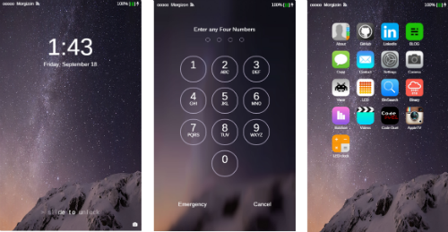

## Phone site

iOS UI concept website using JavaScript (Famous), HTML & CSS.

### Deployed: [morgantheplant.com](http://morgantheplant.com)




---

###Installation

```bash
git clone https://github.com/Famous/engine-seed
cd engine-seed
# rm -rf .git && git init && git commit -m "Make it so" # optionally reset git history
npm i # install dependencies
```

---

###Development
Run the dev server with ```npm run dev```

Now the dev server should be running on localhost:1618

Run the linters with ```npm run lint```

Run All Tests with ```npm test```

---
